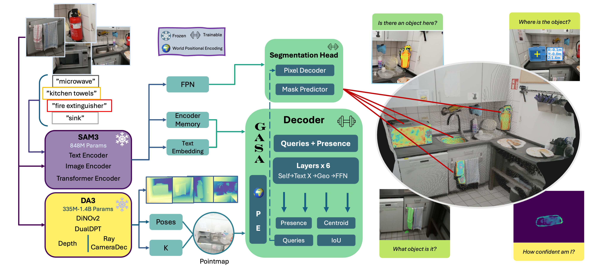
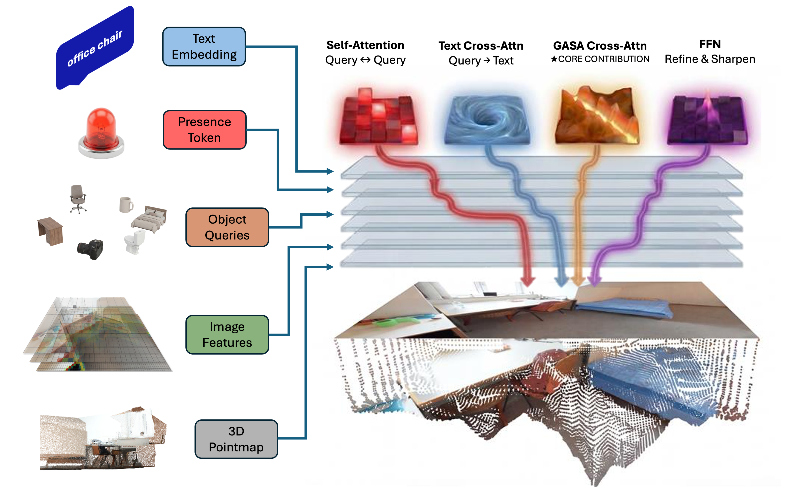

<div align="center">

# TrianguLang

### Geometry-Aware Semantic Consensus for Pose-Free 3D Localization

[Bryce Grant](https://bryceag11.github.io), Aryeh Rothenberg, Atri Banerjee, [Peng Wang](https://pengwangucla.github.io/)<br>
Case Western Reserve University

<a href="https://arxiv.org/abs/2603.08096"></a>
<a href="https://cwru-aism.github.io/triangulang/"></a>
<a href="https://huggingface.co/bag100/triangulang"></a>
<a href="https://huggingface.co/datasets/bag100/triangulang-scannetpp-cache"></a>
<a href="LICENSE"></a>

</div>

<p align="center">
  
</p>

<p align="center">
  
</p>

TrianguLang is a **feed-forward**, **pose-free** method for **language-guided 3D localization** from multi-view images. Given unposed images and a text query (e.g., *"the red mug on the table"*), it produces per-view segmentation masks and a camera-relative 3D location at ~18 FPS for 5-10 classes.

A single text prompt replaces the O(N) per-view click annotations required by prior methods.

## Key Ideas

- **GASA (Geometry-Aware Self-Attention):** Cross-view attention biased by 3D geometry from monocular depth, preventing confusion between semantically similar but spatially distant objects.
- **Pose-free localization:** Metric monocular depth (DA3) gives camera-relative 3D coordinates without pose estimation.
- **Spatial language grounding:** Disambiguate with natural language (*"nearest chair"*, *"leftmost cup"*) using depth-derived spatial reasoning.
- **Multi-object segmentation:** SAM3-style batch expansion for simultaneous multi-object detection from a single forward pass.

## Results

### ScanNet++ (230 training scenes, text-only prompts)

| Model | mIoU | mAcc |
|-------|------|------|
| MV-SAM (12 clicks/view) | 51.0% | 66.0% |
| SAM3 (no cross-view) | 48.6% | - |
| **TrianguLang (text-only)** | **62.4%** | **77.4%** |
| TrianguLang + CRF | 65.2% | - |

### Cross-Dataset Transfer

| Train | Eval | mIoU |
|-------|------|------|
| ScanNet++ | uCO3D | **75.7%** |
| ScanNet++ | NVOS | **93.5%** |
| ScanNet++ | SPIn-NeRF | **91.4%** |
| ScanNet++ | LERF-OVS | **59.2%** |

Inference speed: ~57ms/frame (5-10 classes) on a single A100.

**Frozen:** ~2.5B params (SAM3 841M + DA3-NESTED-GIANT-LARGE 1.69B) | **Trainable:** ~13.5M params (GASA decoder)

## Installation

### Quick Start

```bash
git clone --recursive https://github.com/bryceag11/triangulang.git
cd triangulang
bash setup/install.sh
```

This creates a `triangulang` conda environment with all dependencies. See [setup/INSTALL.md](setup/INSTALL.md) for detailed manual instructions.

### Manual Setup

```bash
conda create -n triangulang python=3.12 -y && conda activate triangulang

pip install torch==2.7.0 torchvision torchaudio --index-url https://download.pytorch.org/whl/cu126
pip install xformers==0.0.30 --index-url https://download.pytorch.org/whl/cu126

git submodule init && git submodule update --recursive
cd sam3 && pip install -e . && cd ..
cd depth_anything_v3 && pip install -e . && cd ..
pip install -r requirements.txt
```

### SAM3 Weights

SAM3 requires HuggingFace authentication:

1. Request access at [huggingface.co/facebook/sam3](https://huggingface.co/facebook/sam3)
2. Authenticate: `hf auth login`

## Data

Download [ScanNet++](https://kaldir.vc.in.tum.de/scannetpp/) and place under `data/scannetpp/`. Pre-cached depth maps and rasterized masks are available at [huggingface.co/datasets/bag100/triangulang-scannetpp-cache](https://huggingface.co/datasets/bag100/triangulang-scannetpp-cache).

The evaluation script also supports NVOS, SpinNeRF, uCO3D, and LERF-OVS.

## Training

```bash
torchrun --nproc_per_node=8 triangulang/training/train.py \
  --run-name my_run \
  --max-scenes 50 --views 8 --epochs 100 \
  --batch-size 1 --lr 1e-4 --lr-warmup-epochs 2 \
  --sampling-strategy stratified
```

| Flag | Description |
|------|-------------|
| `--views N` | Views per scene (default: 8) |
| `--use-centroid-head` | Predict 3D centroid for localization |
| `--no-use-gasa` | Ablation: disable geometric attention bias |
| `--pe-type {world,plucker,rayrope,none}` | Positional encoding type |
| `--cross-view` | Enable cross-view attention fusion |
| `--use-cached-depth` | Use pre-cached DA3 depth maps |
| `--sampling-strategy` | View sampling: `random`, `stratified`, `sequential`, `chunk_aware` |

Training outputs: `runs/train/{run-name}/` | Checkpoints: `checkpoints/{run-name}/`

## Evaluation

```bash
torchrun --nproc_per_node=8 triangulang/evaluation/benchmark.py \
  --checkpoint checkpoints/my_run/best.pt \
  --run-name my_run \
  --prompt-type text_only \
  --max-scenes 50 --num-frames 8
```

## Caching

Pre-caching DA3 depth maps speeds up training:

```bash
torchrun --nproc_per_node=8 scripts/utils/preprocess_da3_nested.py \
  --data-root data/scannetpp --cache-name da3_nested_cache \
  --resolution 504 --chunk-size 16
```

TrianguLang also supports world-frame pointmaps from [MapAnything](https://github.com/facebookresearch/map-anything) and [Pi3](https://github.com/CWRU-AISM/Pi3_tlang) as alternatives to DA3. Pre-compute the cache and pass `--use-cached-pi3x --pi3x-cache-name <name>` during training/eval to bypass DA3.

## Benchmarking Against LangSplat / LERF

For comparable mIoU numbers on LERF-OVS, run with the LangSplat evaluation protocol:

```bash
torchrun --nproc_per_node=8 triangulang/evaluation/benchmark.py \
  --checkpoint checkpoints/my_run/best.pt \
  --dataset lerf_ovs \
  --langsplat-protocol --langsplat-thresh 0.4 --loc-kernel-size 29
```

To reproduce the LangSplat-V2 and LERF baselines directly, we provide forks with rendering fixes as submodules under `third_party/`:

- [`third_party/lerf`](https://github.com/CWRU-AISM/lerf_tlang) -- LERF with fixed eval rendering
- [`third_party/langsplat_v2`](https://github.com/CWRU-AISM/LangSplatV2_tlang) -- LangSplat-V2 with fixed eval rendering

See each submodule's README for training and evaluation commands.

## Project Structure

```
triangulang/
├── triangulang/
│   ├── models/
│   │   ├── gasa.py                # GASA components (PE, attention bias)
│   │   ├── gasa_decoder.py        # GASA decoder layers
│   │   ├── triangulang_model.py   # Main model
│   │   ├── simple_fusion.py       # SAM3 + DA3 fusion heads
│   │   └── sheaf_embeddings.py    # Sheaf consistency & 3D localization
│   ├── training/
│   │   ├── train.py               # Training script
│   │   └── config.py              # Training configuration (tyro)
│   ├── evaluation/
│   │   ├── benchmark.py           # Multi-dataset evaluation
│   │   └── config.py              # Evaluation configuration (tyro)
│   ├── losses/
│   │   ├── segmentation.py        # Focal, dice, boundary losses
│   │   └── sheaf_losses.py        # Sheaf consistency losses
│   ├── data/
│   │   └── dataset_factory.py     # Dataset factory (ScanNet++, NVOS, etc.)
│   └── utils/
│       ├── lora.py                # LoRA adapters
│       ├── metrics.py             # IoU, recall, category tracking
│       ├── ddp_utils.py           # Distributed training
│       ├── scannetpp_loader.py    # ScanNet++ dataset loader
│       └── spatial_reasoning.py   # Spatial language grounding
├── scripts/
│   ├── demo/                      # Demo scripts
│   └── utils/                     # Preprocessing & caching
├── sam3/                          # SAM3 submodule
├── depth_anything_v3/             # DA3 submodule
├── third_party/
│   ├── lerf/                      # LERF fork (benchmarking)
│   ├── langsplat_v2/              # LangSplat-V2 fork (benchmarking)
│   ├── map_anything/              # MapAnything (world-frame pointmaps)
│   └── pi3/                       # Pi3 (world-frame pointmaps)
├── setup/                         # Installation scripts
└── data/                          # Datasets (not included)
```

## Citation

```bibtex
@article{grant2026triangulang,
  title={TrianguLang: Geometry-Aware Semantic Consensus for Pose-Free 3D Localization},
  author={Grant, Bryce and Rothenberg, Aryeh and Banerjee, Atri and Wang, Peng},
  journal={arXiv preprint arXiv:2603.08096},
  year={2026}
}
```

## Acknowledgments

- [SAM3](https://ai.meta.com/research/publications/sam-3-segment-anything-with-concepts/)
- [Depth Anything V3](https://depth-anything-3.github.io/)
- [ScanNet++](https://kaldir.vc.in.tum.de/scannetpp/)

## License

MIT License. See [LICENSE](LICENSE) for details.

This project builds on SAM3 (SAM License) and DA3 (Apache 2.0). See individual licenses in respective submodule directories.
